## Auteurs
- Aboutofil Salma
- Dellahi Hiba
- Ibourk Khadija
# Déploiement Automatisé d'une Application Web avec CI/CD sur Jenkins et AWS
## 1. Création de l’Image Docker : 
- Dans cette première étape, on a commencé par construire l’image Docker de notre application web statique. Depuis le terminal, on s’est placés dans le dossier contenant notre projet (student_list), puis on a exécuté la commande suivante :
` docker build -t supmit-static-site . `
- Comme on le voit dans la capture, Docker a d’abord chargé le Dockerfile, puis il a téléchargé l’image de base nginx:alpine depuis Docker Hub.
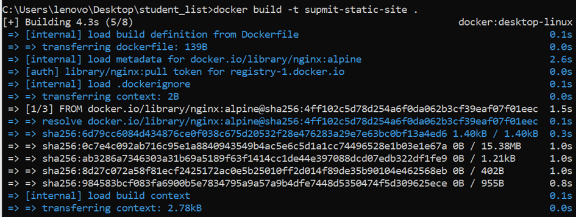
- Une fois le build terminé, on a vérifié dans l’interface Docker Desktop que l’image supmit-static-site:latest avait bien été générée. 
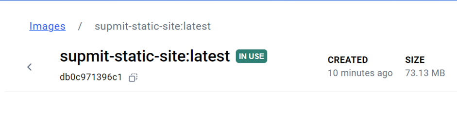
- Le site était accessible localement et affichait un message de bienvenue : "Welcome to Student Checking App", invitant les utilisateurs à cliquer sur un bouton pour lister les étudiants et leurs âges.
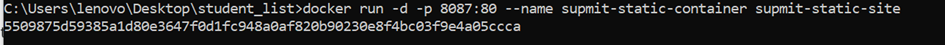
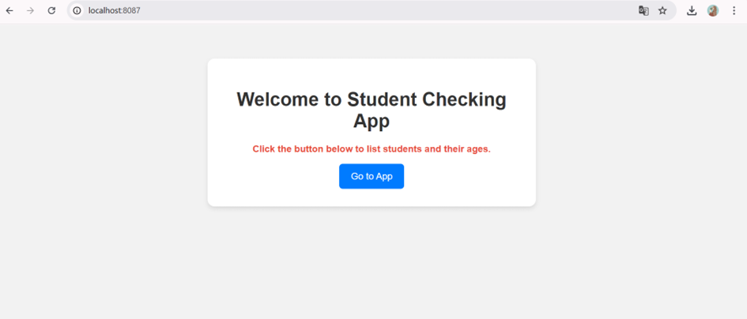
## 2. Configuration de Docker Hub : 
- Nous avons configuré l’authentification avec Docker Hub en utilisant un jeton d’accès. La commande docker login -u kbaijalb a été utilisée, suivie de la saisie du jeton. Ce jeton avait des permissions en lecture seule pour les dépôts publics. Cette étape était cruciale pour pouvoir pousser l’image vers Docker Hub.
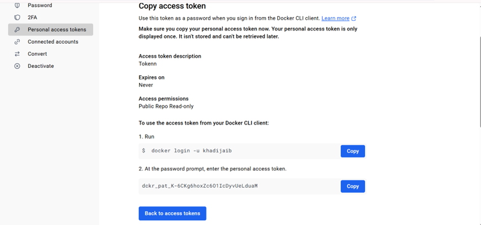
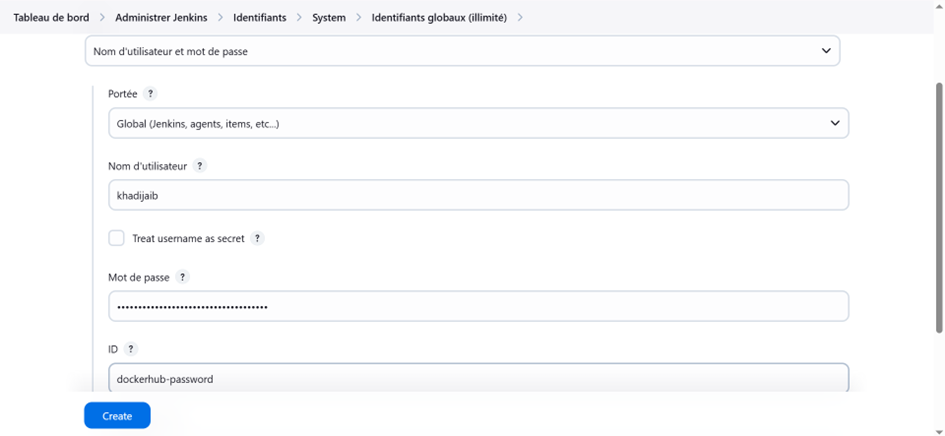
## 3. Intégration avec Jenkins :
- On a créé  un pipeline nommé mini-projet-Docker automatiser les étapes CI/CD.
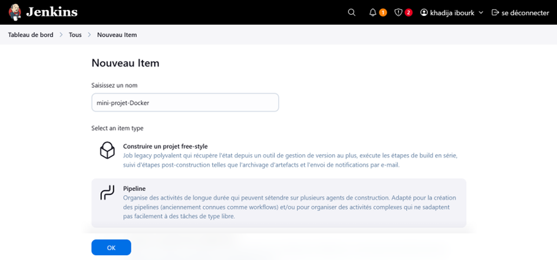
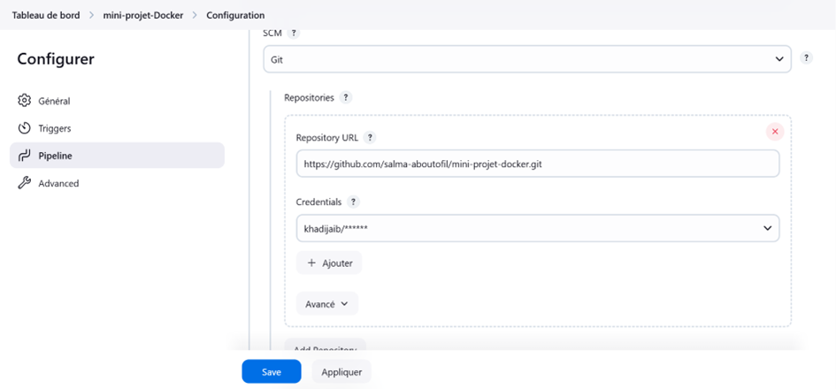
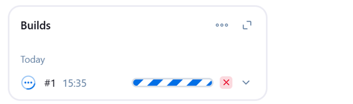
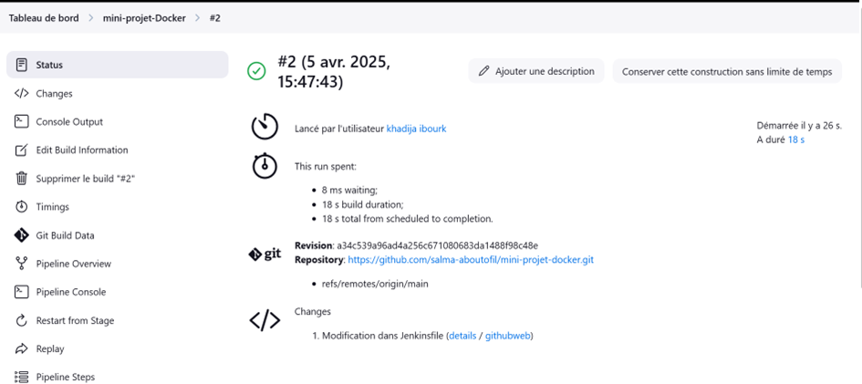
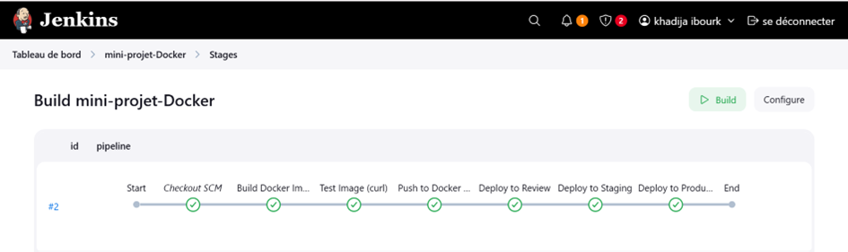
## 4. Configuration et Lancement d'une Instance EC2 sur AWS : 
- Nous avons suivi les étapes pour configurer et lancer une instance Amazon EC2. Tout d'abord, nous avons sélectionné une Amazon Machine Image (AMI) basée sur Ubuntu 24.04, qui définit la configuration logicielle de l'instance. Ensuite, nous avons choisi le type d'instance t3.micro, configuré un nouveau groupe de sécurité pour le pare-feu, et laissé les paramètres de stockage par défaut.
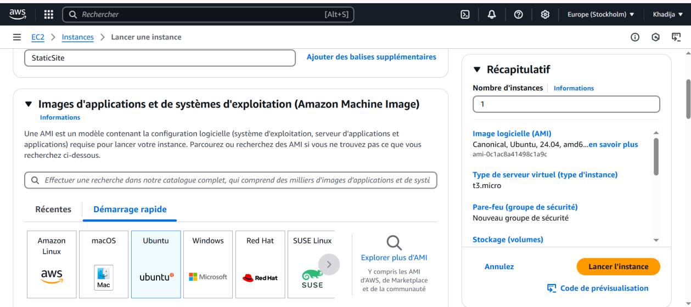
- Puis, nous avons créé une paire de clés pour sécuriser la connexion à l'instance, en optant pour le type RSA avec un format de fichier .pem compatible OpenSSH. Les paramètres réseau ont été laissés par défaut, utilisant un VPC existant et un sous-réseau automatique. Enfin, nous avons vérifié les détails de l'instance avant de la lancer, avec la possibilité de prévisualiser le code de configuration. Ces étapes permettent de déployer une instance EC2 sécurisée et fonctionnelle sur AWS.
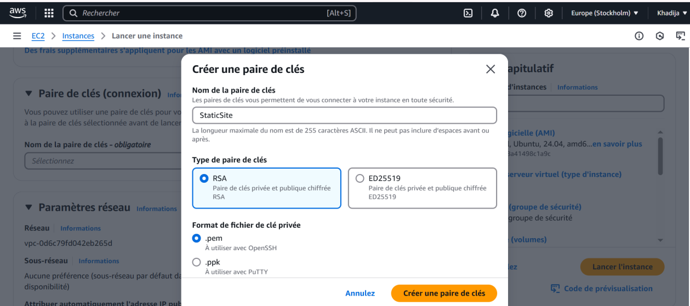
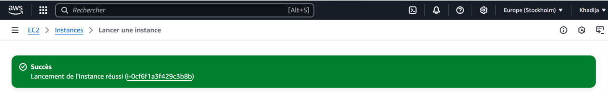

## 5.Déploiement de l'application:
- Nous nous sommes connectés en SSH à l'instance Ubuntu en utilisant une paire de clés (staticsite.pem).
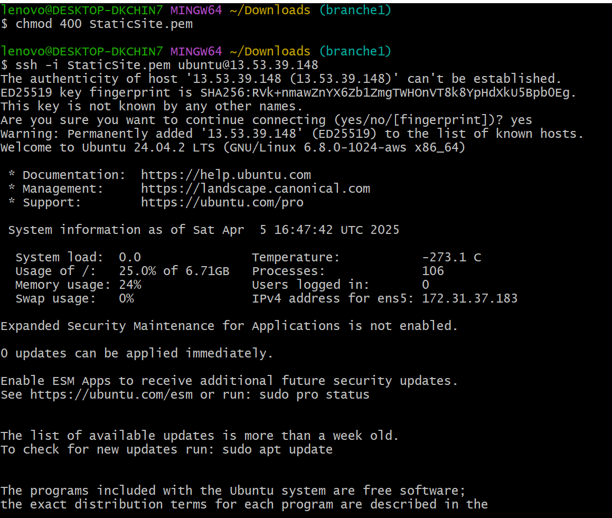
-Puis nous avons vérifié que le service Docker était actif et fonctionnel.
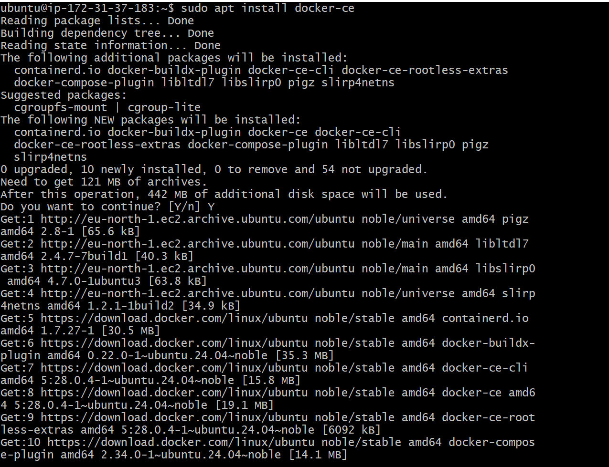
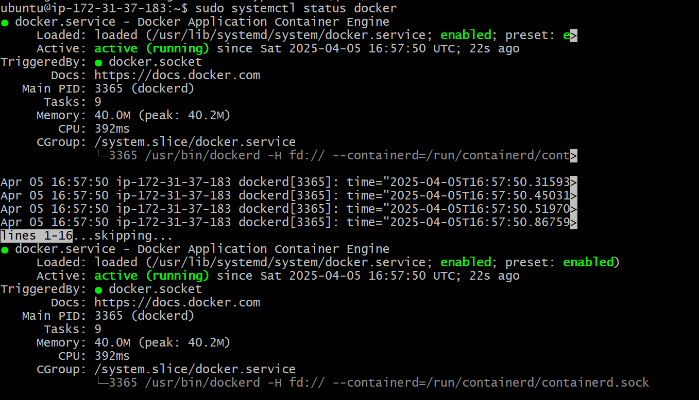
Ensuite, nous avons tenté de télécharger (docker pull) une image Docker nommée khadijah/supmit-static-site, mais comme elle n'existait pas initialement, nous l'avons poussée (docker push) vers Docker Hub après l'avoir créée localement. Après un nouveau docker pull, l'image a été récupérée avec succès.
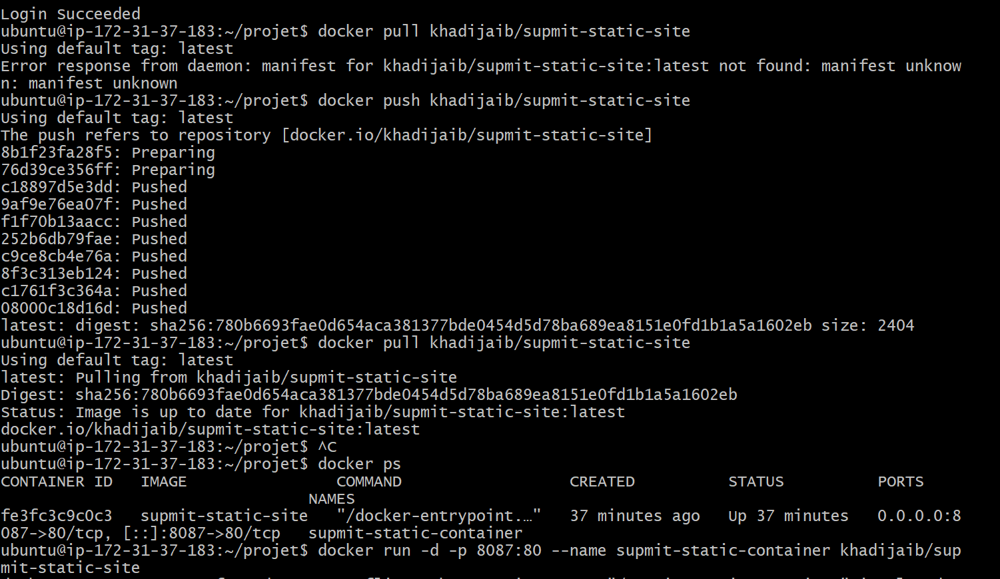

- Enfin, nous avons lancé un conteneur (docker run) en mappant le port 8087 de l'hôte vers le port 80 du conteneur, ce qui a permis d'héberger l'application statique accessible via un navigateur.
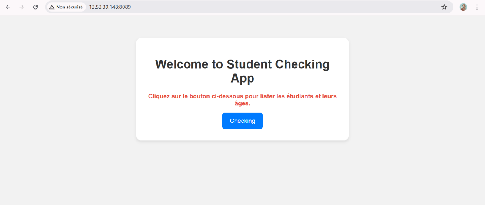
# Mini-Projet-Docker : Conteneurisation d'une Application avec Docker
## Description du Projet
Ce projet consiste à conteneuriser une application Python avec Flask en utilisant Docker. L'application est composée de deux modules :
1. Une API REST en Python qui fournit la liste des étudiants.
2. Une interface web en PHP pour afficher la liste des étudiants.


## I. Construire et tester l'API
### 1.	Création du Dockerfile :
- 	Nous avons créé un fichier Dockerfile pour construire l'image de l'API en utilisant l'image de base python:3.8-buster.
-	Nous avons ajouté les informations du mainteneur (nom, prénom et email) dans le Dockerfile.
-	Le code source de l'API (student_age.py) a été copié dans le conteneur à la racine.
-	Nous avons installé les dépendances nécessaires en utilisant le fichier requirements.txt avec la commande pip3 install -r /requirements.txt.
-	Un volume a été créé pour stocker les données persistantes (le fichier student_age.json).
-	Le port 5000 a été exposé pour permettre à l'API de communiquer avec l'extérieur.
- La commande de démarrage CMD ["python3", "./student_age.py"] a été définie pour exécuter l'API au lancement du conteneur.

**Capture d'écran :**

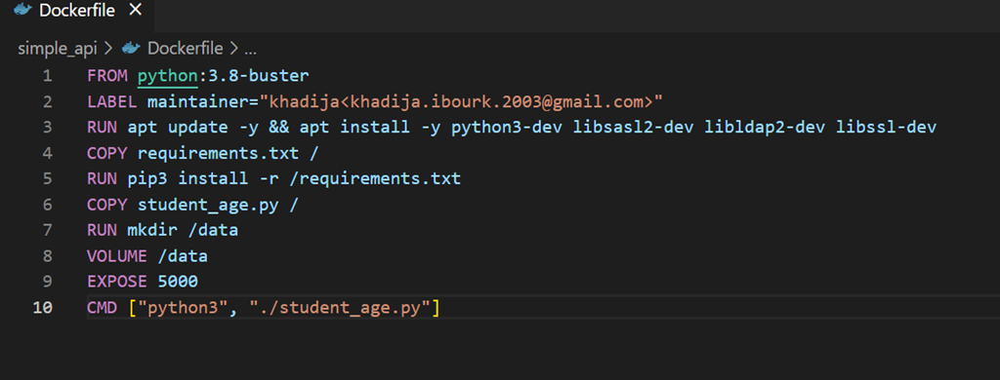
### 2.	Construction et test de l'image :
-	Nous avons construit l'image avec la commande docker build -t api-image 


- Ensuite, nous avons lancé le conteneur en montant le fichier student_age.json dans le dossier /data du conteneur.


-	Pour vérifier que l'API fonctionne correctement, nous avons utilisé la commande curl -u root:root -X GET http://<host IP>:<API exposed port>/SUPMIT/api/v1.0/get_student_ages.
 La réponse de l'API a confirmé que tout fonctionnait correctement.
 

## II. Infrastructure as Code (docker-compose)
### 1.	Création du fichier docker-compose.yml :

- 	Nous avons créé un fichier docker-compose.yml pour déployer l'application en utilisant deux services : website (interface utilisateur en PHP) et api (l'API en Python).
-	Pour le service website, nous avons utilisé l'image php:apache et configuré les variables d'environnement pour l'authentification. Nous avons également monté le dossier ./website dans /var/www/html pour servir le site web.
-	Pour le service api, nous avons utilisé l'image construite précédemment et monté le fichier student_age.json dans /data/student_age.json.
-	Nous avons configuré les ports et ajouté un réseau spécifique pour permettre la communication entre les services.

 
### 2.	Lancement de l'application :
-	Nous avons lancé l'application avec la commande docker-compose up -d


-	Après le démarrage des conteneurs, nous avons accédé à l'interface web et cliqué sur le bouton "List Student" pour afficher la liste des étudiants.


- La liste a été récupérée avec succès depuis l'API, confirmant que l'application fonctionne correctement.

## III. Docker Registry
### 1.	Déploiement d'un registre Docker privé :
-	Nous avons déployé un registre Docker privé en utilisant l'image registry et une interface web pour visualiser les images avec l'image joxit/docker-registry-ui.
-	Nous avons configuré le fichier docker-compose-registry.yml pour lancer le registre et l'interface web.


-	 Après avoir lancé le registre, nous avons poussé l'image de l'API sur le registre privé en utilisant la commande docker tag et docker push.


### 2.	Vérification dans l'interface web :
-	Nous avons accédé à l'interface web du registre pour vérifier que l'image de l'API a bien été poussée et est disponible dans le registre privé.


## Fichiers de Configuration
- `Dockerfile` : Fichier de configuration pour construire l'image de l'API.
- `docker-compose.yml` : Fichier pour déployer l'application avec Docker Compose.
- `docker-compose-registry.yml` : Fichier pour déployer le registre Docker privé.

## Comment exécuter le projet
1. Clonez ce dépôt :
   ```bash
   git clone https://gitlab.com/tp19342208/mini-projet-docker.git